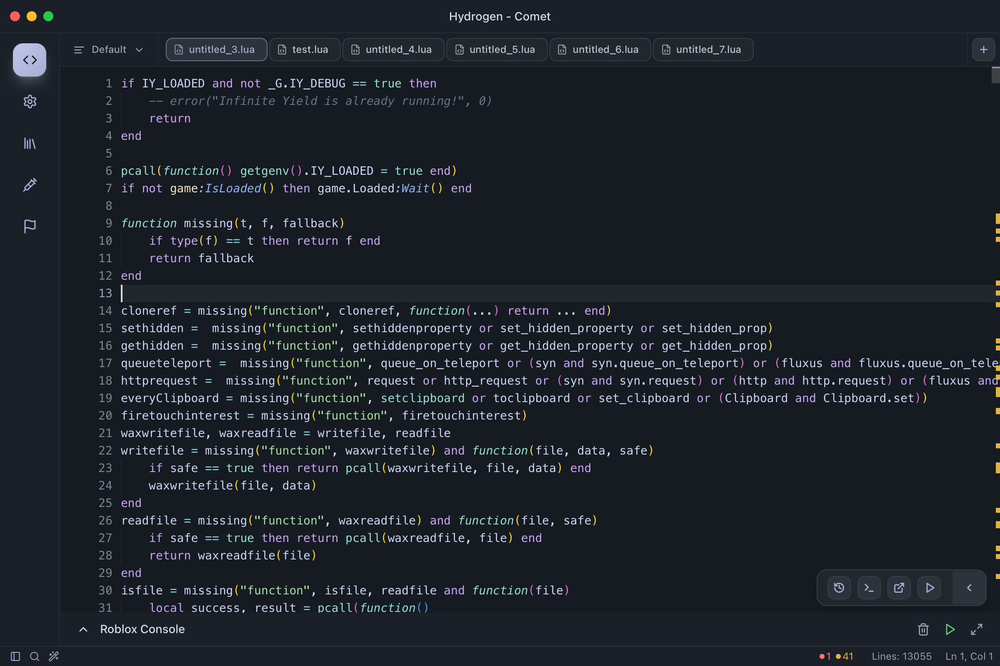
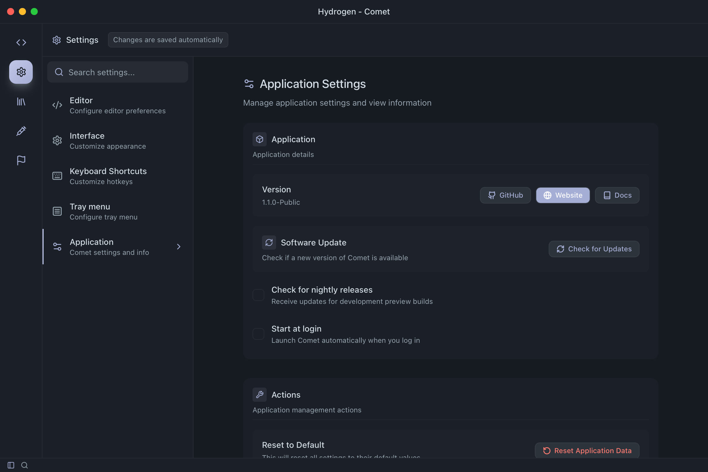
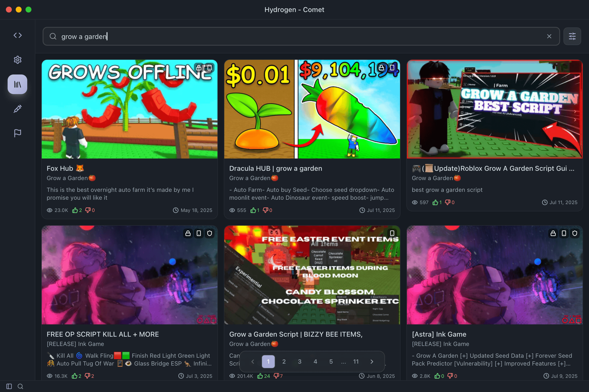
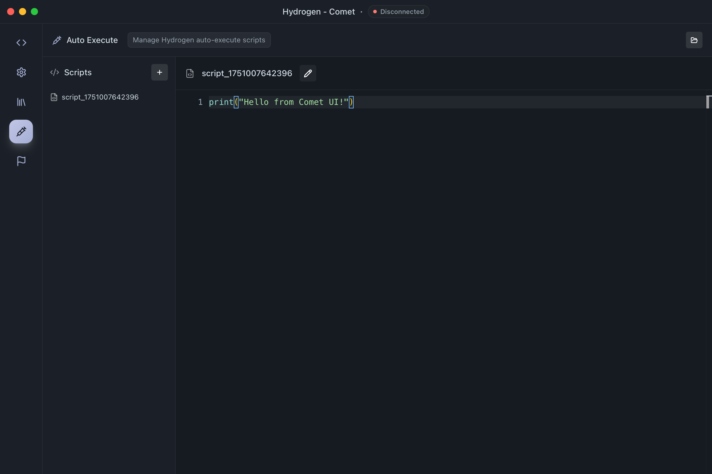
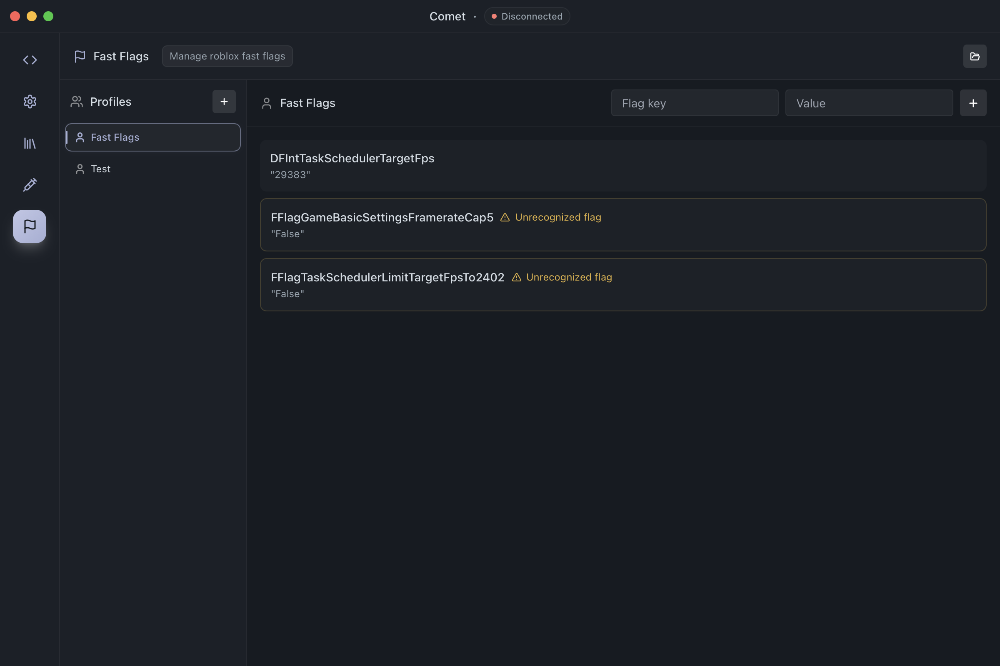

> [!CAUTION]
> Using [Roblox](https://www.roblox.com) executors may result in your account being banned. Use at your own risk. The developers are not responsible for any consequences.

# <div align="center">Comet</div>

<div align="center">
  
</div>

<div align="center">
  <p>A modern, minimalist interface for <a href="https://www.hydrogen.lat/">Hydrogen</a> executor developed with Tauri.</p>
</div>

<div align="center">
  
  
  
  
  
</div>

## <div align="center">✨ Preview</div>

<div align="center">
  <div style="display: flex; justify-content: center; gap: 10px; flex-wrap: wrap;">
    
    
    
    
    
  </div>
</div>

## <div align="center">📚 Documentation</div>

<div align="center">
  <p>For detailed information about features, setup, and development, check out our <a href="docs/documentation.md">documentation</a>.</p>
</div>

## <div align="center">🚀 Getting Started</div>

### Install the ready application

```bash
# One-line installation
curl -s https://www.comet-ui.fun/api/v1/installer | bash
```

### Build from source

```bash
# Clone the repository
git clone https://github.com/FrozenProductions/Comet.git

# Navigate to the directory
cd Comet

# Install dependencies
npm install

# Start development
npm run tauri:dev

# Build for production
npm run tauri:build:universal
```

## <div align="center">📄 License</div>

<div align="center">
  MIT License - See <a href="LICENSE">LICENSE</a> for details
</div>
