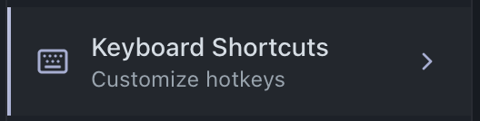
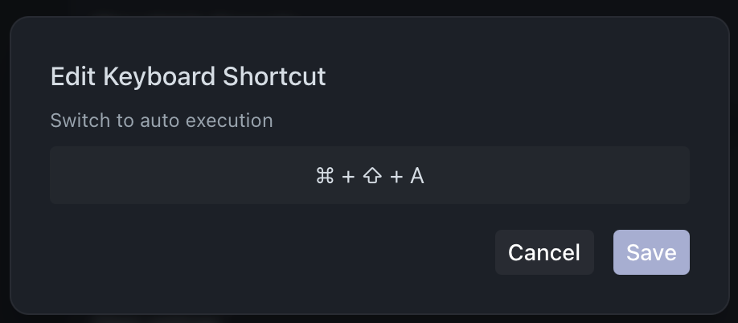
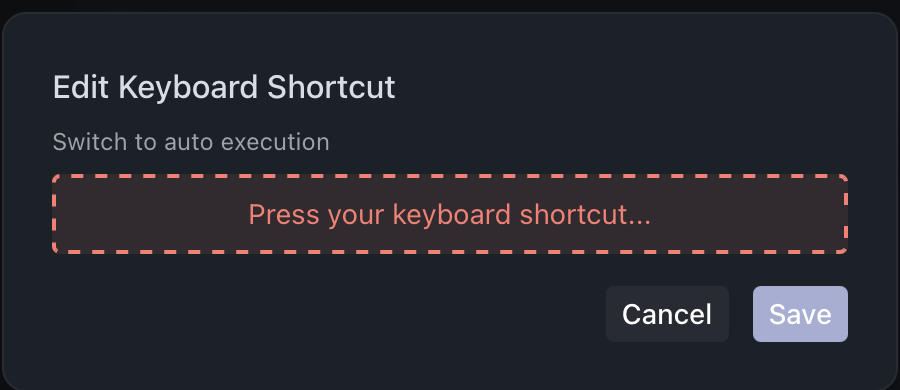

# 
Keybinds

  
Keybinds in Comet provide quick access to various actions and features through customizable keyboard shortcuts.

  

## 
✨ Overview

Keybinds allow you to:

- Execute actions quickly without using the mouse
- Customize shortcuts to match your preferences
- Access all major features of the application efficiently
- Improve your workflow speed

## 
⌨️ Default Keybinds

### Editor Actions

- New Tab: `⌘ T`
- Close Tab: `⌘ W`
- Execute Script: `⌘ Enter`

### Application

- Hide Window: `⌘ Q`
- Toggle Zen Mode: `⌘ ⇧ K`
- Command Palette: `⌘ P`
- Workspace Search: `⌘ ⇧ P`
- Toggle Sidebar: `⌘ B`
- Open Roblox: `⌘ O`
- Expand/Collapse Console: `⌘ J`
- Show/Hide Console: `⌘ L`

### Screen Navigation

- Open Settings: `⌘ ,`
- Switch to Editor: `⌘ ⇧ E`
- Switch to Fast Flags: `⌘ ⇧ F`
- Switch to Library: `⌘ ⇧ L`
- Switch to Auto Execution: `⌘ ⇧ A`

## 
🛠️ Customizing Keybinds

  

To customize a keybind:

1. **Access Keybind Settings**

    - Open Settings
    - Navigate to the Keybinds section

2. **Edit a Keybind**

    - Click on the keybind you want to change
    - A keybind editor will appear
    - Click on the container showing current keybind
    - Wait for "Press your keyboard shortcut..." prompt

    

      
    

    - Press your desired key combination

3. **Save Changes**
    - Click the "Save" button to apply your new keybind
    - The new shortcut will be immediately active

## 
💡 Tips

- Choose intuitive combinations that are easy to remember
- Avoid conflicts with system shortcuts
- Consider your workflow when customizing keybinds
- Use Command Palette (`⌘ P`) for quick access to all features
